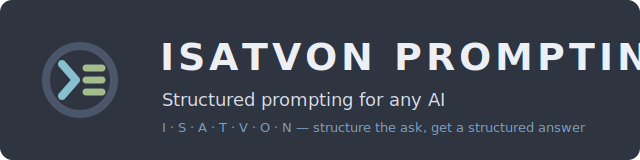

<p align="center">
  
</p>

<p align="center">
  <a href="LICENSE"></a>
  
  
  
</p>

**ISATVON Prompting** applies the seven [ISATVON](https://github.com/isatvon/isatvon)
elements as a prompting framework — like [COSTAR](references/costar-comparison.md), but
the structure covers the **answer as well as the ask**. You write (or let the skill write)
a prompt with seven sections; the model is required to return its response in the same
seven-part structure, so you can see what it assumed, what it used, and whether it
checked itself.

```
Raw prompt ──► I S A T V O N prompt ──► any AI platform ──► I S A T V O N response
              (role/rules, sources,                        (task-as-understood, sources
               method+self-check,                           used, verification, constraints
               tools, constraints,                          honored, the deliverable,
               output contract, meta)                       assumptions & confidence)
```

Works on ChatGPT, Claude, Gemini, Perplexity, Copilot, Grok, and anything else that
reads markdown — it's just text.

## Quick example

**Before:** `Summarize this report for me, keep it short.`

**After:** a seven-section prompt where "short" is *150 words with a declared fallback*,
the model must verify every sentence traces to the report before answering, and the reply
opens with the task as understood — so a misread is visible in one line. Full conversion:
[examples/generic-summarize.md](examples/generic-summarize.md).

## ISATVON vs COSTAR

| COSTAR | ISATVON | ISATVON adds |
|---|---|---|
| Context | **S** — Source | explicit "do not assume" boundary |
| Objective | **I** — Instructions | role + hard rules |
| Style / Tone / Audience | **V** — Variables | measurable limits + fallback |
| Response | **O** — Outcome | the reply itself in ISATVON structure |
| — | **A** — Automation | method + self-verification before answering |
| — | **T** — Tech stack | tool policy (search, code, no fabrication) |
| — | **N** — Notification | mandatory assumptions/confidence report |

Full mapping and when to use which: [references/costar-comparison.md](references/costar-comparison.md).

## Installation

**As an Agent Skill** (Claude Code / Claude Desktop): see [INSTALL.md](INSTALL.md).
Then just ask: *"convert this into an ISATVON prompt: …"*

**Zero-install**: copy [templates/prompt-template.md](templates/prompt-template.md) into
any AI chat and fill in the placeholders. No agent required.

## The seven sections

| Section | In your prompt | In the model's response |
|---|---|---|
| **I** — Instructions | Role, task, rules | The task as it understood it |
| **S** — Source | Context to use, gaps not to fill | Sources it actually used |
| **A** — Automation | Method + self-verification step | How it verified the result |
| **T** — Tech stack | Capabilities allowed/forbidden | — |
| **V** — Variables | Measurable constraints + fallback | Constraints honored or broken |
| **O** — Outcome | Exact response contract | The deliverable itself |
| **N** — Notification | Required meta-reporting | Assumptions, confidence, omissions |

Per-element guidance with good/weak examples: [references/prompting-guide.md](references/prompting-guide.md).

## Repository layout

```
isatvon-prompting/
├── SKILL.md                          # Agent Skill: converts any raw prompt → ISATVON prompt
├── templates/prompt-template.md      # copy-paste skeleton, works without any agent
├── references/
│   ├── prompting-guide.md            # the 7 elements as prompt sections
│   ├── costar-comparison.md          # COSTAR ↔ ISATVON mapping
│   └── response-format.md            # the structured-response contract
├── examples/                         # before/after conversions: generic, ChatGPT, Claude,
│                                     #   Gemini, Perplexity, Copilot, Grok
├── INSTALL.md · CITATIONS.md · CHANGELOG.md · CONTRIBUTING.md · LICENSE
└── assets/banner.svg
```

## When not to use ISATVON prompting

- **One-shot stylistic asks** — a tweet rewrite or a tone change doesn't need seven
  sections; plain COSTAR (or nothing) is fine.
- **Conversation** — this structures deliverables, not chat.
- **Agent loop contracts** — if you need a bounded, machine-validated retry loop
  (JSON manifest, MCP tools, guaranteed exits), that's the
  [ISATVON specification](https://github.com/isatvon/isatvon) and its
  [validator](https://github.com/isatvon/isatvon-validator), not this repo.

## Contributing

Example conversions are the most valuable contribution — see
[CONTRIBUTING.md](CONTRIBUTING.md).

## Enterprise

ISATVON is an open framework by [DigiBull](https://digibull.ai). For enterprise prompt
governance, analytics, and hosted orchestration, see DigiBull Enterprise.

---

Apache-2.0 · [Citations & inspiration](CITATIONS.md)
